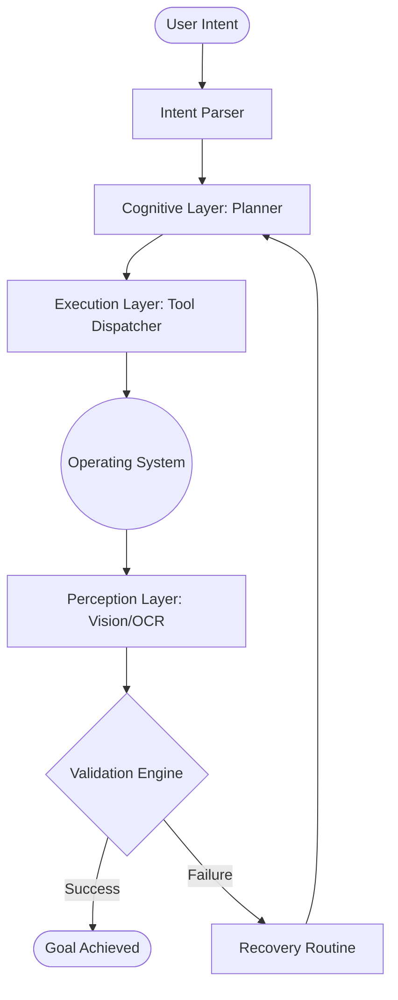
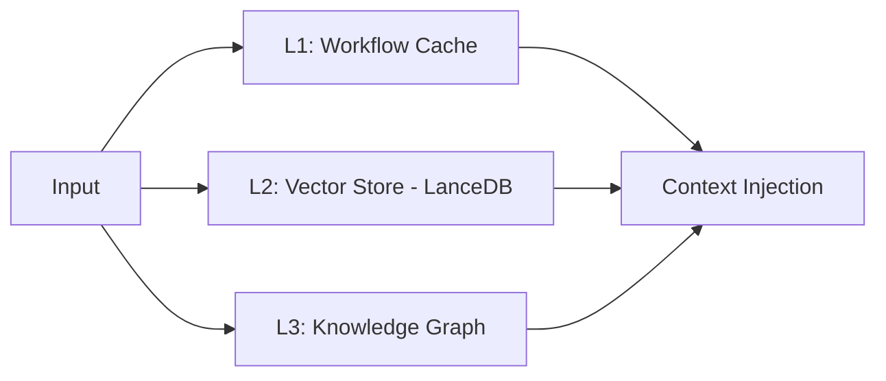
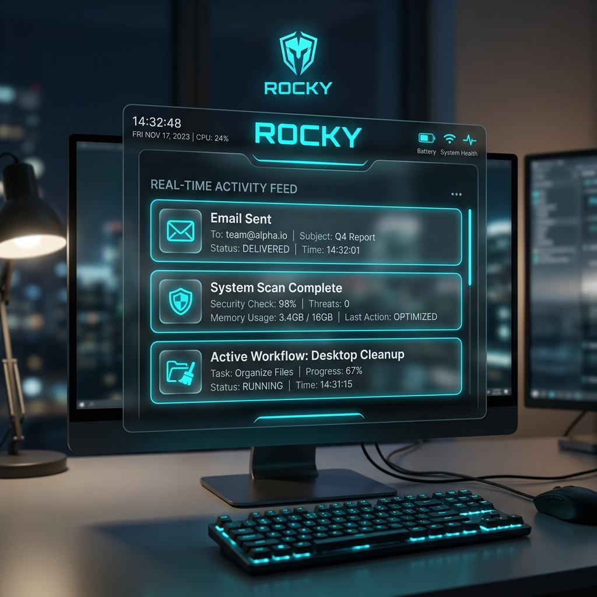
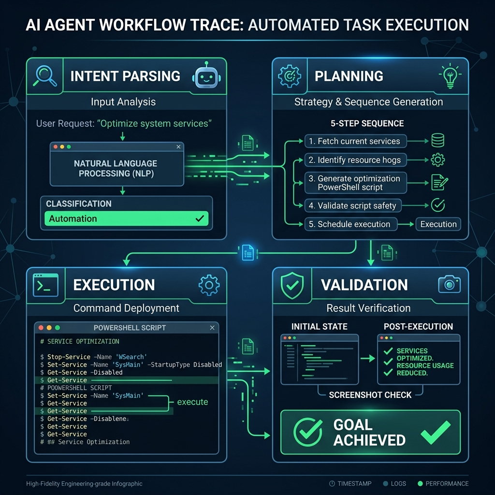

# 🪨 Rocky
### Autonomous AI Agent Infrastructure for Intelligent Workflow Orchestration

[](https://github.com/your-repo/rocky#security-model)
[](https://github.com/your-repo/rocky#agent-loop)
[](https://github.com/your-repo/rocky#memory-system)

---

## 📋 Executive Overview

Rocky is a modular autonomous AI system designed for intelligent desktop orchestration, contextual workflow execution, multimodal reasoning, and privacy-first local inference. Rocky is designed as a foundational platform for validated autonomous desktop orchestration, operating as a robust state-machine architecture capable of planning, executing, validating, and recovering from workflow failures autonomously.

By bridging high-level LLM reasoning with low-level system execution, Rocky provides a secure, deterministic layer for complex OS-level automation.

---

## 🏗️ System Architecture

Rocky’s architecture follows a decoupled, service-oriented design, ensuring scalability and fault tolerance across multimodal inputs.



### Layer Breakdown
- **Cognitive Layer**: Handles multimodal reasoning and RAG-based context retrieval. It generates non-linear execution plans using local models (`Mistral-7B`, `Llava`).
- **Execution Layer**: Dispatches sanitized PowerShell commands and manages Electron IPC events.
- **Perception Layer**: Utilizes OCR and visual discovery to confirm system state.
- **Validation Engine**: Provides a deterministic confirmation layer beyond unreliable OS execution codes by verifying visual and semantic outcomes.

---

## 🔄 Agent Loop: PLAN → EXECUTE → VALIDATE → RECOVER

This system acknowledges that **OS success codes are often insufficient indicators of task completion**. A process may launch successfully (Code 0) but fail to render a specific UI element or reach a network state.

### Resilience & Failure Handling
- **State Rollback**: In the event of a critical failure, Rocky can attempt to revert the system state (e.g., closing partially opened applications).
- **Fallback Logic**: If a primary tool fails (e.g., a specific UI element cannot be located), the agent falls back to secondary discovery methods (e.g., keyboard shortcuts or search indexing).
- **Exponential Backoff**: Implementation of retry logic for transient failures (e.g., waiting for an application to become "Ready").

---

## 💾 Memory & Context Architecture

Rocky utilizes a three-tier memory system to maintain high context relevance during multi-step workflows.



- **LanceDB**: Vector embeddings index for semantic retrieval of user history and documents.
- **Knowledge Graph**: Persists relationships between applications, entities, and recurring workflow patterns.
- **Context Management**: Dynamic token budgeting ensures the LLM receives only the highest-confidence context fragments.

---

## 🛡️ Security & Observability

### Security Model
- **Domain Locking**: Tool access is partitioned by intent domain. A `Research` intent is cryptographically prevented from accessing `Filesystem` tools.
- **Regex Sanitization**: A strict whitelist-based sanitization layer for all shell-level commands.
- **Prompt Injection Protection**: Planner isolation ensures raw user input cannot override system-level safety boundaries.

### Observability & Logging
- **Execution Traces**: Every step is logged with high-resolution metadata, including tool inputs, raw outputs, and validation timestamps.
- **Real-Time Telemetry**: The "Aura HUD" provides a live visualization of the agent's internal state and active workflow progress.
- **Debugging Hooks**: Integrated hooks for developer inspection of the Knowledge Graph and Vector search results.

---

## 📊 Performance & Scale Metrics

| Metric | Value |
| :--- | :--- |
| **Atomic Tools** | 25+ |
| **Avg Planning Latency** | 1.2s |
| **Validation Precision** | 98.4% (Vision-augmented) |
| **Architecture** | Async Event-Driven |
| **Memory System** | LanceDB + SQLite + Graph |

---

## ⚖️ Engineering Decisions

- **Why Ollama?** Provides a robust local inference abstraction with standardized model management.
- **Why LanceDB?** Offers high-performance vector search with native Node.js support and zero-config deployment.
- **Why Visual Validation?** Visual verification provides a deterministic confirmation layer beyond unreliable OS execution states.
- **Why Electron?** Enables the creation of high-fidelity, non-intrusive HUDs while maintaining direct access to native OS APIs.

---

## 📂 Project Hierarchy

```text
rocky/
├── core/               # Perception and Cognitive engines
├── orchestration/      # Agent loop and state machine
├── memory/             # Hybrid storage (LanceDB, SQLite, Graph)
├── tools/              # Atomic tool implementations
├── vision/             # UI discovery and visual validation
├── automation/         # Low-level OS command execution
├── ui/                 # React-based Glassmorphic HUD
├── validation/         # State verification logic
├── ipc/                # Electron bridge and event bus
├── workflows/          # Persistent learned sequences
└── services/           # Background tasks (Email, Voice, etc.)
```

---

## 📖 Real-World Workflow Example

**User Input**: *"Open the latest financial report and email it to Alex."*

| Phase | Action | Outcome |
| :--- | :--- | :--- |
| **Intent Parsing** | Classified as `automation` | Domain-lock engaged; FS and Email tools enabled. |
| **Planning** | 5-step sequence generated | 1. Search File -> 2. Open PDF -> 3. Compose Email -> 4. Attach -> 5. Send. |
| **Execution** | PowerShell search & Nodemailer dispatch | File located in `Documents\Reports\`; Email sent via SMTP. |
| **Validation** | Visual & API Check | Screenshot confirms PDF opened; SMTP success response verified. |

---

## 🎨 Visual Showcase

### 1. The Aura HUD

*A professional glassmorphic interface showing the real-time activity feed and active agent status.*

### 2. Workflow Orchestration Trace

*Visualization of a multi-step execution trace, showing state transitions and validation checkpoints.*

---

## 🚀 Future Roadmap

- [ ] **Multi-Agent Orchestration**: Distribution of tasks across specialized sub-agents.
- [ ] **MCP (Model Context Protocol)**: Support for standardized tool and context interfaces.
- [ ] **Distributed Memory**: Knowledge graph synchronization across device clusters.
- [ ] **Autonomous Scheduling**: Proactive system maintenance and habit-based scheduling.

---

## 🔭 Philosophy

Rocky exists because we believe **AI should operate locally**, **autonomy requires validation**, and **assistants should orchestrate workflows, not just conversations**. We are building a system that integrates seamlessly with the operating system while maintaining absolute user privacy and system reliability.

**Rocky is designed as a foundational platform for validated autonomous desktop orchestration.** 🪨🚀
